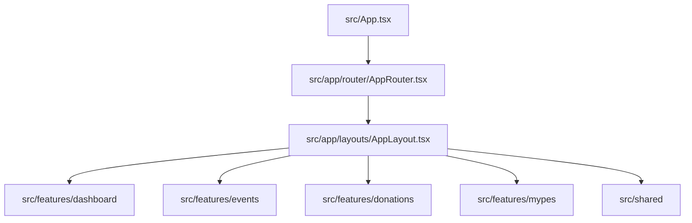

# 🏗️ Arquitectura del Sistema — STARE Piura

Este documento detalla el diseño de arquitectura implementado en **STARE Piura** (Sistema de Trazabilidad y Asignación de Recursos para Entidades de Apoyo Social).

---

## 1. Patrón Arquitectónico: Feature-Folder (Module-Based)

Para garantizar la mantenibilidad y escalabilidad del proyecto, se ha adoptado una estructura orientada a **Funcionalidades (Features)** o **Módulos**. En lugar de agrupar los archivos por su rol técnico (todos los componentes en un lado, todos los hooks en otro), el código se organiza según el dominio de negocio al que pertenece.



### Ventajas de este enfoque:
- **Alta Cohesión:** Todo el código relacionado con una característica de negocio (tipos, componentes, hooks, estilos) se encuentra en un mismo lugar.
- **Bajo Acoplamiento:** Los módulos se comunican entre sí a través de interfaces públicas bien definidas (`index.ts` o barrels de exportación).
- **Escalabilidad:** Añadir una nueva funcionalidad es tan sencillo como crear una nueva carpeta bajo `src/features/` sin perturbar el resto de la aplicación.

---

## 2. Estructura de Directorios

La estructura general del código fuente en `src/` se divide en tres pilares principales:

```
src/
├── app/                    # Configuración global y núcleo del sistema
│   ├── config/             # Configuración general (app.config.ts)
│   ├── layouts/            # Estructura visual principal (AppLayout.tsx)
│   ├── providers/          # Contenedores de contexto global
│   └── router/             # Enrutamiento basado en estado (AppRouter.tsx)
│
├── features/               # Módulos de dominio (Feature-Based)
│   ├── dashboard/          # Centro de control logístico y Kardex financiero
│   ├── events/             # Cronograma de visitas y actividades
│   ├── donations/          # Gestión y registro de microdonaciones (MYPEs y otros)
│   ├── finance/            # Balance financiero, fondos y análisis de brechas
│   ├── mypes/              # Directorio y gestión de micro y pequeñas empresas aliadas
│   ├── organizations/      # Directorio de entidades de apoyo social beneficiarias
│   └── volunteer/          # Gestión de voluntariado y asignación de tareas
│
└── shared/                 # Código transversal e infraestructura reutilizable
    ├── components/         # Componentes UI genéricos (Button, Modal, Input)
    ├── constants/          # Constantes globales (ej. distritos de Piura)
    ├── hooks/              # Custom hooks de utilidad general (useLocalStorage)
    ├── services/           # Clases o funciones de servicios transversales (storage)
    ├── types/              # Tipos globales TypeScript
    └── utils/              # Funciones puras de utilidad
```

---

## 3. Anatomía de una Feature

Cada módulo dentro de `src/features/[feature-name]/` sigue una estructura estricta para asegurar consistencia:

1. **`components/`**: Componentes exclusivos de la funcionalidad (ej. `KardexTable.tsx` en `dashboard`).
2. **`hooks/`**: Lógica de estado y llamadas de datos encapsuladas en React Hooks (ej. `useDonations.ts`).
3. **`types/`**: Definiciones de interfaces TypeScript del dominio.
4. **`services/`**: Lógica de integración y persistencia específica (ej. persistencia local).
5. **`index.ts` (Barrel file)**: Archivo que exporta únicamente lo que otros módulos tienen permitido consumir. **Ningún archivo fuera de esta feature debe importar directamente desde subcarpetas internas; todo debe pasar por este barrel.**

---

## 4. Gestión de Estado y Persistencia (Offline-First)

El sistema está diseñado bajo la filosofía **Offline-first**, permitiendo un funcionamiento autónomo y sin conexión.

- **Almacenamiento Local:** Se utiliza `localStorage` como base de datos local principal.
- **Prefijo de Clave:** Para evitar colisiones en el navegador, todas las claves del storage utilizan el prefijo `stare_` (ej. `stare_events`, `stare_donations`).
- **Sincronización:** Los hooks reactivos se encargan de leer el estado inicial del storage y sincronizar en caliente cualquier modificación realizada por el usuario.

---

## 5. Diseño Visual y Estilos

- **TailwindCSS 4:** Se utiliza la última especificación de Tailwind con carga modular en `src/index.css`.
- **Motion (Framer Motion v11+):** Empleado para transiciones de pantalla suaves, aperturas de modales dinámicas y micro-interacciones interactivas.
- **Iconos:** Proveídos uniformemente por `lucide-react`.

---

> [!NOTE]
> Para conocer las guías de estilo de código específicas, consulte el archivo [CODING_GUIDELINES.md](file:///D:/stare-piura/docs/CODING_GUIDELINES.md). Para instrucciones de despliegue y desarrollo local, consulte [DEVELOPER_GUIDE.md](file:///D:/stare-piura/docs/DEVELOPER_GUIDE.md).
