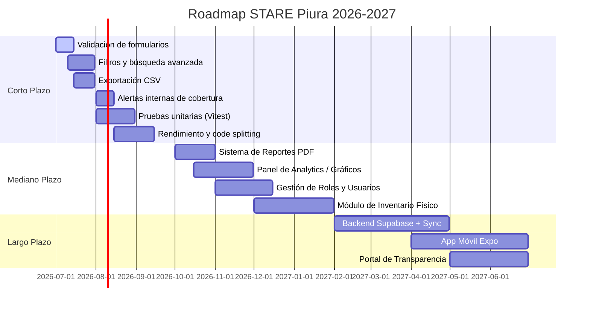

# Hoja de Ruta — STARE Piura

> **Versión del documento:** 1.0.0 | **Fecha:** 2026-06-22  
> **Responsable del producto:** Equipo de Innovación Digital — Prefectura Zonal de Piura

---

## Visión del Producto

> *"Convertir a STARE Piura en la plataforma de referencia para la gestión humanitaria descentralizada en la región Piura, permitiendo que los coordinadores sociales tomen decisiones basadas en datos en tiempo real, incluso en contextos de conectividad limitada."*

### Principios que guían el roadmap

| Principio | Descripción |
|---|---|
| **Offline-first** | Toda funcionalidad debe estar disponible sin internet |
| **Simple para el usuario** | Las personas no técnicas deben poder usar el sistema sin entrenamiento extensivo |
| **Trazabilidad completa** | Cada movimiento de recurso debe quedar registrado y ser auditable |
| **Escalabilidad responsable** | Crecer en funcionalidad sin sacrificar rendimiento ni usabilidad |
| **Impacto social medible** | Cada mejora debe traducirse en más beneficiarios atendidos o mejor uso de recursos |

---

## Corto Plazo — 1 a 3 meses (Julio – Septiembre 2026)

Mejoras de consolidación y usabilidad sobre la versión v1.0.0 lanzada.

### Mejoras de Usabilidad

#### Validación de Formularios (Prioridad: Alta)
- Mensajes de error en línea al lado del campo incorrecto
- Validación en tiempo real mientras el usuario escribe
- Prevención de registros duplicados (mismo nombre de MYPE o donante)
- Confirmación al intentar eliminar un registro

#### Filtros y Búsqueda Avanzada (Prioridad: Alta)
- Filtro de donaciones por: rango de fechas, tipo, método de pago, monto mínimo/máximo
- Filtro del kardex por: fondo, tipo (ingreso/egreso), categoría
- Filtro del directorio MYPE por: rubro, tipo de aporte, distrito
- Paginación en listados con más de 30 registros

#### Alertas Internas (Prioridad: Media)
- Badge de alerta en el ítem del sidebar cuando alguna bolsa está en crítico (< 30%)
- Indicador visual en el dashboard cuando algún fondo está por debajo del mínimo configurado
- Resumen de alertas activas en el header del sistema

### Mejoras Técnicas

#### Exportación de Datos (Prioridad: Alta)
- Exportar kardex de movimientos a CSV
- Exportar listado de donaciones a CSV
- Exportar directorio MYPE a CSV
- Vista de impresión optimizada para cada módulo (CSS @media print)

#### Rendimiento (Prioridad: Media)
- Virtualización de listas con más de 100 registros (usando `@tanstack/virtual`)
- Memoización de cálculos de balance y brechas con `useMemo`
- Lazy loading de módulos con `React.lazy()` para reducir el bundle inicial

#### Calidad de Código (Prioridad: Media)
- Añadir pruebas unitarias con Vitest para todos los hooks de feature
- Añadir pruebas de integración con Testing Library para formularios críticos
- Configurar ESLint con reglas estrictas de TypeScript
- Documentar todas las interfaces TypeScript con JSDoc

---

## Mediano Plazo — 3 a 6 meses (Octubre 2026 – Enero 2027)

Nuevas funcionalidades que expanden el alcance del sistema.

### Nuevos Módulos y Funcionalidades

#### Sistema de Reportes (Prioridad: Alta)
- Reporte mensual ejecutivo de fondos (ingresos vs. egresos vs. saldo)
- Reporte de donaciones por período con gráficos de barras y torta
- Reporte de cobertura de eventos: qué se entregó, a quién, cuándo
- Exportación de reportes en PDF generado en el navegador (usando `jsPDF`)
- Plantillas de reporte predefinidas para auditoría de la Prefectura

#### Panel de Analytics y Visualización (Prioridad: Alta)
- Gráfico de evolución de fondos en el tiempo (línea mensual, últimos 6 meses)
- Mapa de calor de eventos por distrito de Piura
- Gráfico de distribución de donaciones por tipo y método de pago
- Ranking de MYPEs por monto total donado
- Indicadores de impacto: total de beneficiarios atendidos, eventos realizados

#### Gestión de Usuarios y Roles (Prioridad: Media)
- Pantalla de inicio de sesión con PIN o contraseña sencilla
- Roles: Coordinador General (acceso total), Voluntario (solo lectura + registro de donaciones)
- Registro de auditoría: quién creó / modificó / eliminó cada registro y cuándo
- Cierre de sesión automático por inactividad

#### Módulo de Inventario Físico (Prioridad: Media)
- Registro de artículos en bodega con cantidades exactas
- Movimientos de inventario: entrada (donación), salida (distribución en evento)
- Alertas de stock mínimo por artículo
- Código de ítem / código de barras para registro rápido
- Reportes de inventario: existencias actuales, movimientos del mes

### Mejoras a Módulos Existentes

#### Command-Center Logístico
- Gráfico de mini sparkline en cada tarjeta KPI mostrando evolución de 7 días
- Conciliación: comparar saldo del sistema vs. saldo real ingresado por el coordinador
- Opción de archivar movimientos de meses anteriores

#### Cronograma y Visitas
- Vista de semana además de la vista mensual
- Repetición de eventos (semanal, mensual)
- Recordatorios: al acceder al sistema, mostrar eventos del día actual
- Asignación de voluntarios responsables por evento

#### Directorio MYPE
- Ficha completa de empresa con historial de donaciones
- Sistema de "favoritos" para MYPEs que donan con frecuencia
- Integración con módulo de donaciones: al registrar donación, buscar MYPE del directorio

---

## Largo Plazo — 6 a 12 meses (Febrero – Junio 2027)

Evolución arquitectónica para mayor escala e impacto.

### Sincronización en la Nube

#### Backend con Supabase (Prioridad: Alta para v2.0)
- Base de datos PostgreSQL en la nube para persistencia duradera
- Autenticación con Supabase Auth (email + contraseña o magic link)
- Sincronización automática: los cambios locales se sincronizan cuando hay internet (sync-first)
- Resolución de conflictos: estrategia "último en escribir gana" para datos simples
- Respaldo automático diario de todos los datos en la nube

#### Acceso Multi-dispositivo (Prioridad: Alta para v2.0)
- El coordinador puede trabajar desde su computadora y su tablet con los mismos datos
- Múltiples usuarios de la Prefectura acceden simultáneamente con sus propias cuentas
- Historial de auditoría completo con nombre de usuario

### Aplicación Móvil

#### App Android / iOS con React Native o Expo (Prioridad: Media)
- Versión móvil para voluntarios de campo que registran donaciones in situ
- Formulario simplificado de donación optimizado para celular
- Cámara para escanear comprobantes de Yape/Plin
- Sincronización con la versión web al conectarse a internet

### Integraciones Externas

#### Integración con RENIEC (Largo plazo)
- Verificación de RUC/DNI del donante contra base de datos de RENIEC/SUNAT
- Autocompletado de datos al ingresar RUC de una MYPE

#### Notificaciones por WhatsApp (Mediano-largo plazo)
- Notificación automática al coordinador cuando se registra una nueva donación
- Recordatorio de eventos próximos por WhatsApp

#### Portal Público de Transparencia (Largo plazo)
- Sitio web de solo lectura donde la comunidad puede ver los recursos gestionados
- Publicación voluntaria de reportes mensuales de uso de fondos
- QR en materiales de comunicación que lleva al portal de transparencia

---

## Tabla de Prioridades

| # | Feature | Impacto | Esfuerzo | Prioridad | Plazo |
|---|---|---|---|---|---|
| 1 | Validación de formularios | Alto | Bajo | 🔴 P1 | Corto |
| 2 | Filtros en listados | Alto | Bajo | 🔴 P1 | Corto |
| 3 | Exportación CSV | Alto | Bajo | 🔴 P1 | Corto |
| 4 | Sistema de reportes PDF | Alto | Medio | 🔴 P1 | Mediano |
| 5 | Alertas internas de cobertura | Medio | Bajo | 🟡 P2 | Corto |
| 6 | Panel de Analytics / Gráficos | Alto | Medio | 🟡 P2 | Mediano |
| 7 | Gestión de roles y usuarios | Alto | Medio | 🟡 P2 | Mediano |
| 8 | Módulo de Inventario Físico | Alto | Alto | 🟡 P2 | Mediano |
| 9 | Pruebas unitarias (Vitest) | Medio | Medio | 🟡 P2 | Corto |
| 10 | Backend Supabase + Sync | Alto | Alto | 🟡 P2 | Largo |
| 11 | Acceso multi-dispositivo | Alto | Alto | 🟠 P3 | Largo |
| 12 | App móvil (Expo) | Medio | Muy alto | 🟠 P3 | Largo |
| 13 | Repetición de eventos | Medio | Bajo | 🟠 P3 | Mediano |
| 14 | Portal de transparencia | Medio | Alto | 🟠 P3 | Largo |
| 15 | Integración RENIEC/SUNAT | Bajo | Alto | ⚪ P4 | Largo |
| 16 | Notificaciones WhatsApp | Medio | Alto | ⚪ P4 | Largo |

**Leyenda de prioridad:** 🔴 Crítico | 🟡 Importante | 🟠 Deseable | ⚪ Futuro

---

## Mejoras Técnicas Recomendadas

### Deuda técnica a resolver en v1.1.0

| Ítem | Descripción | Urgencia |
|---|---|---|
| **Pruebas** | Cobertura mínima del 70% con Vitest en hooks de feature | Alta |
| **Validación** | Integrar Zod para validación de schemas de formularios y localStorage | Alta |
| **Accesibilidad** | Auditoría con axe-core y corrección de problemas WCAG AA | Media |
| **Bundle size** | Analizar con `vite-bundle-analyzer` y aplicar code splitting | Media |
| **SEO básico** | Meta tags, title dinámico por módulo, manifest.json para PWA | Baja |

### Mejoras de arquitectura para v2.0

| Ítem | Descripción |
|---|---|
| **PWA** | Convertir a Progressive Web App con Service Worker para instalación en dispositivos |
| **IndexedDB** | Migrar de localStorage a IndexedDB para manejo de datasets más grandes (> 10,000 registros) |
| **TanStack Query** | Reemplazar `useLocalStorage` por TanStack Query cuando se integre backend REST |
| **Optimistic UI** | Actualizar la UI inmediatamente y sincronizar con el servidor en segundo plano |
| **Error Boundaries** | Añadir `ErrorBoundary` por módulo para aislar errores sin romper toda la app |

---

## Métricas de Éxito

### Métricas de uso (operativas)

| Métrica | Baseline (v1.0) | Meta v1.1 | Meta v2.0 |
|---|---|---|---|
| Donaciones registradas / mes | 0 | ≥ 30 | ≥ 100 |
| Eventos gestionados / mes | 0 | ≥ 4 | ≥ 12 |
| MYPEs en directorio | 0 (seed) | ≥ 20 | ≥ 60 |
| Organizaciones registradas | 0 (seed) | ≥ 10 | ≥ 30 |
| Cobertura promedio de bolsas | n/d | ≥ 65% | ≥ 80% |

### Métricas de calidad técnica

| Métrica | Baseline (v1.0) | Meta v1.1 | Meta v2.0 |
|---|---|---|---|
| Cobertura de pruebas | 0% | ≥ 70% | ≥ 85% |
| Lighthouse Performance | n/d | ≥ 85 | ≥ 95 |
| Lighthouse Accessibility | n/d | ≥ 90 | ≥ 95 |
| Tamaño del bundle inicial | ~450 KB | < 300 KB | < 250 KB |
| Errores en producción / mes | n/d | 0 críticos | 0 críticos |

### Métricas de impacto social

| Métrica | Meta 6 meses | Meta 12 meses |
|---|---|---|
| Beneficiarios indirectos registrados | ≥ 500 | ≥ 2,000 |
| Fondos trazados en el sistema (S/) | ≥ S/ 10,000 | ≥ S/ 50,000 |
| Organizaciones beneficiarias activas | ≥ 15 | ≥ 40 |
| Tiempo ahorrado en reportes manuales | ≥ 4h/semana | ≥ 8h/semana |

---

## Hitos del Roadmap

---

*Hoja de ruta sujeta a revisión trimestral según retroalimentación de los coordinadores de la Prefectura Zonal de Piura.*  
*STARE Piura v1.0.0 — Sistema de Trazabilidad y Asignación de Recursos para Entidades de Apoyo Social.*
