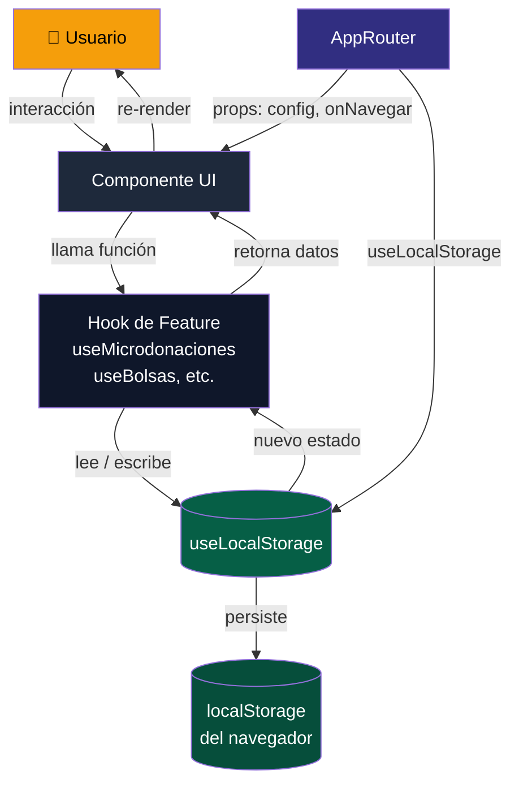
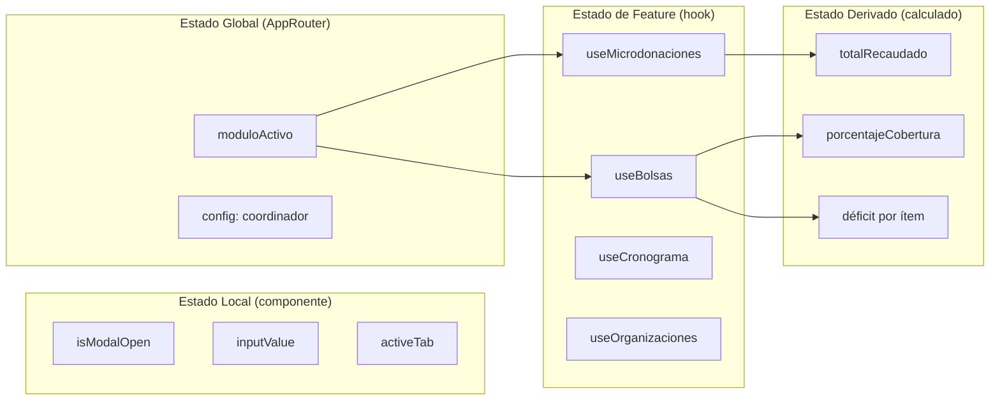

# Manejo de Estado — STARE Piura

> **Versión:** 1.0.0 | **Última actualización:** 2026-06-22

---

## 1. Estrategia Elegida

STARE Piura utiliza una estrategia de estado **local-first** basada en:

| Capa | Herramienta | Alcance |
|---|---|---|
| Estado UI efímero | `useState` de React | Un solo componente |
| Estado de feature | Custom hook (`useFeature`) | Un módulo / pantalla |
| Estado global persistido | `useLocalStorage` hook | Toda la aplicación |
| Estado derivado | Funciones puras / `useMemo` | En lugar del cálculo |

### Hook principal: `useLocalStorage`

```ts
// src/hooks/useLocalStorage.ts
import { useState, useEffect } from 'react';

export function useLocalStorage<T>(key: string, initialValue: T) {
  const [storedValue, setStoredValue] = useState<T>(() => {
    try {
      const item = window.localStorage.getItem(key);
      return item ? (JSON.parse(item) as T) : initialValue;
    } catch {
      return initialValue;
    }
  });

  const setValue = (value: T | ((prev: T) => T)) => {
    try {
      const valueToStore =
        value instanceof Function ? value(storedValue) : value;
      setStoredValue(valueToStore);
      window.localStorage.setItem(key, JSON.stringify(valueToStore));
    } catch (error) {
      console.error(`[useLocalStorage] Error guardando "${key}":`, error);
    }
  };

  return [storedValue, setValue] as const;
}
```

---

## 2. Por Qué NO se Usa Redux / Zustand / Context

### Justificación de la decisión

STARE Piura es una aplicación **offline-first** diseñada para operar en entornos con conectividad limitada (zonas rurales de Piura). La complejidad de librerías externas de estado global contradice los principios del proyecto:

| Librería | Razón de descarte |
|---|---|
| **Redux Toolkit** | Overhead de boilerplate innecesario para la escala actual. Añade ~25 KB al bundle. La app no tiene acciones asíncronas complejas ni time-travel debugging. |
| **Zustand** | Dependencia externa que requiere instalación y actualización. El hook `useLocalStorage` cumple la misma función con cero dependencias adicionales. |
| **React Context + useReducer** | Apropiado para estado compartido entre muchos componentes profundamente anidados. En STARE Piura, el estado se comparte entre pocos módulos y puede pasarse como props o accederse desde el hook. Además, Context provoca re-renders globales innecesarios. |
| **TanStack Query** | Diseñado para sincronización con servidor remoto. STARE Piura trabaja íntegramente con localStorage sin llamadas HTTP en v1.0. |

### Cuándo reconsiderar (criterios de escalada)

- Si se añade backend/API REST → considerar TanStack Query.
- Si el estado compartido supera 5 módulos con datos entrelazados → considerar Zustand.
- Si se implementa sincronización multi-tab → considerar BroadcastChannel + Zustand.

---

## 3. Dónde Guardar Cada Tipo de Estado

### 3.1 Estado Local (componente)

Estado **efímero** que sólo importa dentro de un componente y no necesita persistirse.

**Ejemplos:**
- Visibilidad de un modal (`isModalOpen`)
- Valor actual de un campo de texto antes de enviarlo
- Tab activa dentro de una vista

```tsx
// ✅ Correcto — estado de UI local
function DonacionForm() {
  const [isOpen, setIsOpen] = useState(false);
  const [monto, setMonto] = useState('');

  return (
    <>
      <button onClick={() => setIsOpen(true)}>Nueva donación</button>
      {isOpen && (
        <Modal onClose={() => setIsOpen(false)}>
          <input value={monto} onChange={e => setMonto(e.target.value)} />
        </Modal>
      )}
    </>
  );
}
```

### 3.2 Estado de Feature (custom hook)

Estado que pertenece a **un módulo completo** (pantalla) y que necesita lógica de negocio encapsulada. Se crea un hook por feature.

**Convención de nombre:** `use<NombreFeature>` dentro de `src/features/<feature>/hooks/`

```ts
// src/features/microdonaciones/hooks/useMicrodonaciones.ts
import { useLocalStorage } from '@/hooks/useLocalStorage';
import type { Donacion } from '../types';

const STORAGE_KEY = 'stare_donaciones';

export function useMicrodonaciones() {
  const [donaciones, setDonaciones] = useLocalStorage<Donacion[]>(
    STORAGE_KEY,
    []
  );

  const agregarDonacion = (nueva: Omit<Donacion, 'id' | 'fecha'>) => {
    const donacion: Donacion = {
      ...nueva,
      id: crypto.randomUUID(),
      fecha: new Date().toISOString(),
    };
    setDonaciones(prev => [donacion, ...prev]);
  };

  const eliminarDonacion = (id: string) => {
    setDonaciones(prev => prev.filter(d => d.id !== id));
  };

  // Estado derivado: total recaudado
  const totalRecaudado = donaciones
    .filter(d => d.tipo === 'monetaria')
    .reduce((acc, d) => acc + d.monto, 0);

  return { donaciones, agregarDonacion, eliminarDonacion, totalRecaudado };
}
```

**Hooks de feature existentes:**

| Feature | Hook | Clave localStorage |
|---|---|---|
| Fondos / KPIs | `useFondos` | `stare_fondos` |
| Kardex | `useKardex` | `stare_kardex` |
| Cronograma | `useCronograma` | `stare_eventos` |
| Bolsas de Evento | `useBolsas` | `stare_bolsas` |
| Microdonaciones | `useMicrodonaciones` | `stare_donaciones` |
| Directorio MYPE | `useDirectorioMype` | `stare_mypes` |
| Organizaciones | `useOrganizaciones` | `stare_organizaciones` |
| Balance / Brechas | `useBalance` | *(derivado de otros)* |

### 3.3 Estado Global (AppRouter / raíz)

Estado que **múltiples features** necesitan leer o mutar. En STARE Piura, esto se limita a:

- Módulo activo (navegación actual)
- Configuración del usuario (nombre del coordinador, institución)

```tsx
// src/AppRouter.tsx
export function AppRouter() {
  const [moduloActivo, setModuloActivo] = useState<ModuloId>('dashboard');
  const [config, setConfig] = useLocalStorage<AppConfig>(
    'stare_config',
    { coordinador: '', institucion: 'Prefectura Zonal de Piura' }
  );

  return (
    <div className="flex h-screen">
      <Sidebar
        moduloActivo={moduloActivo}
        onNavegar={setModuloActivo}
      />
      <main className="flex-1 overflow-y-auto bg-slate-50">
        <ModuloRenderer modulo={moduloActivo} config={config} />
      </main>
    </div>
  );
}
```

---

## 4. Flujo de Datos Unidireccional

STARE Piura sigue el patrón **unidireccional** estricto:

```
Usuario interactúa
       ↓
Componente UI (evento: onClick, onChange)
       ↓
Hook de Feature (lógica de negocio)
       ↓
useLocalStorage (persistencia)
       ↓
Estado actualizado → re-render del componente
```

**Regla de oro:** Los componentes **nunca** escriben directamente en localStorage. Siempre delegan al hook correspondiente.

```tsx
// ❌ Incorrecto — el componente accede a localStorage directamente
function MiComponente() {
  const guardar = () => {
    localStorage.setItem('stare_datos', JSON.stringify(datos));
  };
}

// ✅ Correcto — el componente delega al hook
function MiComponente() {
  const { agregarDonacion } = useMicrodonaciones();

  const guardar = (datos: NuevaDonacion) => {
    agregarDonacion(datos);
  };
}
```

---

## 5. Patrones

### 5.1 Estado Derivado

El estado derivado **nunca se guarda en estado independiente**. Se calcula en el hook o con `useMemo`.

```ts
// ✅ Estado derivado calculado, NO almacenado
export function useBalance() {
  const { bolsas } = useBolsas();
  const { donaciones } = useMicrodonaciones();

  // Derivado: déficit por ítem
  const deficit = useMemo(() =>
    bolsas.map(bolsa => ({
      ...bolsa,
      faltante: Math.max(0, bolsa.metaUnidades - bolsa.unidadesActuales),
      porcentajeCobertura: (bolsa.unidadesActuales / bolsa.metaUnidades) * 100,
    })),
    [bolsas]
  );

  return { deficit };
}
```

### 5.2 Efectos Secundarios

Los efectos que no son persistencia (ej: notificaciones, logging) van en `useEffect` dentro del hook.

```ts
export function useKardex() {
  const [movimientos, setMovimientos] = useLocalStorage<Movimiento[]>(
    'stare_kardex',
    []
  );

  // Efecto secundario: log de auditoría en consola (desarrollo)
  useEffect(() => {
    if (import.meta.env.DEV) {
      console.debug('[Kardex] Total movimientos:', movimientos.length);
    }
  }, [movimientos]);

  return { movimientos };
}
```

### 5.3 Inicialización con Datos Semilla

Para datos de demostración, se usa un patrón de inicialización lazy:

```ts
const SEED_KEY = 'stare_seed_v1';

export function useBolsas() {
  const [bolsas, setBolsas] = useLocalStorage<Bolsa[]>('stare_bolsas', []);

  useEffect(() => {
    const seeded = localStorage.getItem(SEED_KEY);
    if (!seeded && bolsas.length === 0) {
      setBolsas(BOLSAS_SEED_DATA);
      localStorage.setItem(SEED_KEY, 'true');
    }
  }, []); // Solo al montar

  return { bolsas, setBolsas };
}
```

### 5.4 Reseteo de Estado

Cada hook expone una función `resetear` para limpiar sus datos:

```ts
const resetear = () => {
  setDonaciones([]);
  localStorage.removeItem(STORAGE_KEY);
};
```

---

## 6. Buenas Prácticas

| Práctica | Descripción |
|---|---|
| **Claves prefijadas** | Todas las claves de localStorage comienzan con `stare_` para evitar colisiones |
| **Tipos estrictos** | Cada entidad tiene su interfaz TypeScript en `src/features/<feature>/types.ts` |
| **IDs con crypto.randomUUID()** | No usar `Date.now()` ni índices como IDs |
| **Estado mínimo** | Guardar sólo lo necesario; calcular el resto como estado derivado |
| **Un hook por feature** | No mezclar lógica de diferentes módulos en un mismo hook |
| **No efectos en handlers** | Los event handlers son síncronos; los efectos van en `useEffect` |
| **Inmutabilidad** | Siempre usar `prev => [...]` o `prev => ({...prev})`, nunca mutar el array directamente |

---

## 7. Diagrama de Flujo de Estado





---

## 8. Estructura de Archivos Relacionados

```
src/
├── hooks/
│   └── useLocalStorage.ts          ← Hook base de persistencia
├── features/
│   ├── dashboard/
│   │   └── hooks/
│   │       ├── useFondos.ts
│   │       └── useKardex.ts
│   ├── cronograma/
│   │   └── hooks/
│   │       └── useCronograma.ts
│   ├── bolsas/
│   │   └── hooks/
│   │       └── useBolsas.ts
│   ├── microdonaciones/
│   │   └── hooks/
│   │       └── useMicrodonaciones.ts
│   ├── directorio/
│   │   └── hooks/
│   │       └── useDirectorioMype.ts
│   ├── organizaciones/
│   │   └── hooks/
│   │       └── useOrganizaciones.ts
│   └── balance/
│       └── hooks/
│           └── useBalance.ts       ← Solo estado derivado
└── AppRouter.tsx                   ← Estado global
```

---

*Documentación generada para STARE Piura v1.0.0 — Sistema de Trazabilidad y Asignación de Recursos para Entidades de Apoyo Social, Prefectura Zonal de Piura.*
